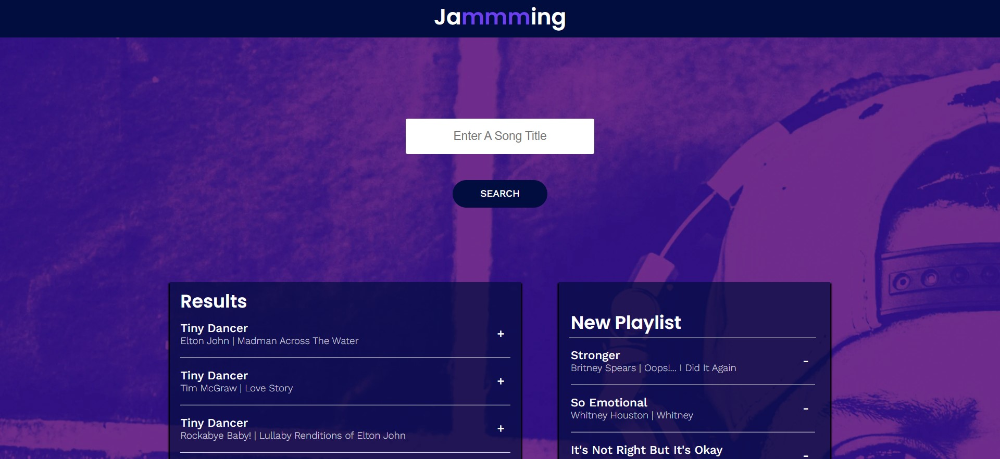

# Jammming

Jammming is a react web application that allows users to search the Spotify library, create a custom playlist, then save it to their Spotify account.

Built with the help of,
- React components
- Passing state
- Spotify API 

